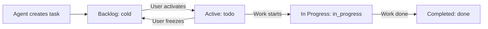

# Workflow: Backlog Management

**When user asks**: "What's in my backlog?", "Add task to backlog", "Show cold tasks", "Move to backlog"

## What is Backlog?

The Backlog is the **cold storage** for tasks in Focus. Tasks with `status: "cold"` appear here, regardless of whether they're assigned to a project or not. This is the default destination for agent-created tasks.

**Key concept:** Backlog prevents you from being overwhelmed. Tasks sit in cold storage until you're ready to focus on them.

```
┌─────────────────────────────────────────────────────────────┐
│                      BACKLOG (status: cold)                 │
│                                                             │
│  • Tasks created by agents (default)                        │
│  • Tasks you've frozen to work on later                     │
│  • Can be assigned to projects OR unassigned                │
│  • NOT visible in active project views                      │
└─────────────────────────────────────────────────────────────┘```

---

## Common Actions

### 1. View Backlog Tasks

**Tool:** `focus_list_tasks` with `status: ["cold"]`

```json
{
  "name": "focus_list_tasks",
  "arguments": {
    "status": ["cold"],
    "limit": 20
  }
}
```

**With filters:**
```json
{
  "name": "focus_list_tasks",
  "arguments": {
    "status": ["cold"],
    "priority": ["p1", "p2"],
    "projectId": "specific-project-uuid"
  }
}
```

### 2. Add Task to Backlog (Default Agent Behavior)

**Tool:** `focus_create_task`

When creating a task WITHOUT specifying status, it defaults to `"cold"` (backlog):

```json
{
  "name": "focus_create_task",
  "arguments": {
    "title": "Research competitor pricing",
    "priority": "p2"
  }
}
```

**With project assignment:**
```json
{
  "name": "focus_create_task",
  "arguments": {
    "title": "Design new landing page",
    "priority": "p1",
    "projectId": "marketing-project-uuid"
  }
}
```

### 3. Activate Task from Backlog

**Tool:** `focus_update_task`

Move a task from backlog to active by changing status:

```json
{
  "name": "focus_update_task",
  "arguments": {
    "id": "task-uuid",
    "status": "todo"
  }
}
```

### 4. Send Task to Backlog

**Tool:** `focus_update_task`

Move an active task to backlog:

```json
{
  "name": "focus_update_task",
  "arguments": {
    "id": "task-uuid",
    "status": "cold"
  }
}
```

---

## Task Status Flow



---

## Best Practices

### ✅ Do
- Let agent-created tasks default to backlog (`status: "cold"`)
- Assign projects to backlog tasks when relevant
- Activate tasks from backlog when ready to focus
- Use backlog to prevent being overwhelmed

### ❌ Don't
- Don't confuse backlog with the old "inbox" concept
- Don't create tasks with `status: "todo"` unless user explicitly wants them active immediately
- Don't leave high-priority tasks in backlog forever

---

## Examples

### Example 1: User asks "What's in my backlog?"

```json
{
  "name": "focus_list_tasks",
  "arguments": {
    "status": ["cold"],
    "limit": 15
  }
}
```

**Response:** "You have 8 tasks in your backlog. 3 are high priority (p1/p2)..."

### Example 2: User asks "Add a task to research React 19"

```json
{
  "name": "focus_create_task",
  "arguments": {
    "title": "Research React 19 new features",
    "priority": "p3",
    "description": "Look into new hooks, server components, and performance improvements"
  }
}
```

**Response:** "Added 'Research React 19 new features' to your backlog with low priority."

### Example 3: User asks "Activate task X from my backlog"

```json
{
  "name": "focus_update_task",
  "arguments": {
    "id": "task-uuid-from-backlog",
    "status": "todo"
  }
}
```

**Response:** "Activated 'Research React 19' from your backlog. It's now visible in your active tasks."

---

## Related Workflows

- **Tasks:** [`skills/focus/workflows/tasks.md`](skills/focus/workflows/tasks.md) - General task management
- **Projects:** [`skills/focus/workflows/projects.md`](skills/focus/workflows/projects.md) - Finding project IDs
- **Search:** [`skills/focus/workflows/search.md`](skills/focus/workflows/search.md) - Finding specific tasks
